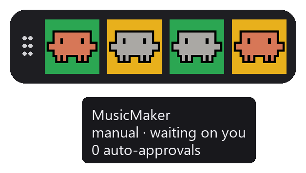
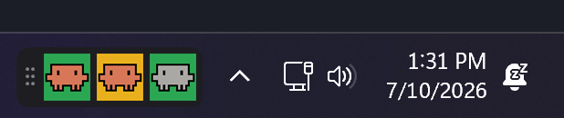

# Hooker 🪝

A little pixel mascot that auto-approves Claude Code prompts and shows, at a
glance, which of your Claude sessions needs you — an always-on-top **widget**
with one mascot tile **per session**.



## Reading a tile (two independent axes)

**Background = does it need you** · **Mascot = is it on autopilot**

|                        | 🟢 green (your turn)            | 🟡 yellow (working)   |
| ---------------------- | ------------------------------- | --------------------- |
| **salmon** (hooking)   | auto — but waiting on you        | auto-responding       |
| **grey** (manual)      | your turn                        | working, prompts normally |

- **Green** = that session is **waiting on you** (a prompt, a question, or it finished and wants the next task).
- **Yellow** = that session is **working** (busy — sit tight).
- **Salmon** mascot = **hooking** (its prompts auto-approve). **Grey** = **manual** (normal prompting).

Each tile is labeled with the session's **`/name`** (falling back to its folder), and it goes yellow the instant Claude starts *thinking* — both read live from Claude's own session registry. Each session is independent: one can be on autopilot while another is hand-driven and a third sits waiting.

## The widget

A borderless, always-on-top strip. One tile per live session — here it is docked next to the system tray:



- **Left-click a tile** — toggle that session's hooking (salmon ⇄ grey).
- **Drag a tile** — reorder it (works locked or not), to match your terminal layout.
- **Drag the grip** (dots on the left) — move the whole widget (only when **unlocked**).
- **Hover a tile** — a tip (placed above/below, never over the tiles) shows `name · hooking/manual · working/waiting · N auto-approvals`.
- **Right-click** — menu: version, **Dismiss** (per tile), **Lock/Unlock position**, **New sessions appear** (right/left), **Grow direction** (auto / anchor-right / anchor-left), **Reset position**, **Exit**.

It stays **in front of the taskbar**, **hides** while a fullscreen app owns the same monitor (games safe), and defaults to **centered just above the taskbar**. Position, lock, order, anchor, and new-session side persist to `widget.json`.

> **Start menu:** while the Windows 11 Start menu is *open*, it renders above all normal windows, so a widget sitting on/under it is hidden until Start closes — an OS limitation. Park it above the taskbar and off-center to always keep it visible.

### Stale tiles

A session that ends cleanly (`/exit`) removes its tile via `SessionEnd`. An abrupt close (killed terminal, crash) can't, so the widget **auto-prunes** any tile silent for `StaleHours` (default **24h**, `0` disables in `widget.json`) — self-healing, since the session's next hook event recreates its tile. Right-click → **Dismiss** clears one instantly.

## ⚠️ Security — read this

**Hooking is a permission bypass.** When a session's tile is salmon (hooking), Hooker **auto-approves every `PreToolUse` prompt** for that session — Bash commands, file writes/edits, network, memory writes, MCP tools, everything — with no confirmation. A session on autopilot has Claude's approval gate **turned off**, so a bad or prompt-injected instruction could run destructive or exfiltrating commands unattended.

Mitigations baked in: hooking is **off by default**, per session, and every session is forced back to **off when the widget exits**. Only turn a tile salmon when you trust what that session is doing. If in doubt, leave it grey and approve normally.

## How it works

```
widget (HookerWidget.exe) --writes--> ...\.claude\hooker\sessions\<sid>.state   ("on"/"off")
hooks  (hook.exe)         --writes--> ...\.claude\hooker\sessions\<sid>.meta    ({status,cwd,count})
                          <--read---  widget polls the .meta + Claude's session registry each 100ms
```

`hook.exe` is registered on six Claude events, all per session:
- `SessionStart` → new tile (waiting), count reset
- `UserPromptSubmit` / `PreToolUse` → working (`PreToolUse` auto-approves + bumps the count when that session is hooking)
- `AskUserQuestion` (a `PreToolUse`) → waiting (Claude needs you to pick)
- `Stop`, `Notification` → waiting
- `SessionEnd` → removes the session's files

The widget also reads Claude's internal per-session registry (`~/.claude/sessions/*.json`) for the `/name` title and live busy status — **best-effort**: it's undocumented and may change between Claude versions, in which case tiles fall back to folder names + hook-based status (nothing breaks).

The shim **fails open**: any error → prints nothing, exits 0 → Claude behaves normally. It never blocks Claude.

## Install (just want to use it)

No building — five steps, all double-clicks:

1. **Install the runtime** (one time). Download the free **[.NET Desktop Runtime 8](https://dotnet.microsoft.com/download/dotnet/8.0)** — under **"Run desktop apps"**, grab the **Windows x64** installer — and run it.
2. **Download Hooker.** Get the latest [**release**](../../releases) `.zip`, then right-click it → **Extract All**.
3. **Turn on the hooks.** Double-click **`Install Hooker.cmd`**. A window opens, prints *"Installed…"*, and waits for a keypress. *(It registers Hooker with Claude Code and backs up your existing settings first.)*
4. **Restart Claude Code.** Close and reopen any `claude` terminals so they load the hooks.
5. **Run the widget.** Double-click **`HookerWidget.exe`**. The mascot strip appears near your clock. **Click a tile** to put that session on autopilot (salmon = auto-approving); click again for manual (grey).

> ⚠️ Autopilot auto-approves **everything** for that session — read [Security](#️-security--read-this) first.

**Auto-start at login:** drop a shortcut to `HookerWidget.exe` into `shell:startup` (Win+R → `shell:startup`).

### Build from source instead

Needs the **.NET 8 SDK**. Then:
```powershell
powershell -ExecutionPolicy Bypass -File .\build.ps1          # -> dist\hook.exe, dist\HookerWidget.exe
powershell -ExecutionPolicy Bypass -File .\install-hook.ps1   # register hooks (or double-click "Install Hooker.cmd")
```
Restart Claude and run `dist\HookerWidget.exe`.

> **Moved or re-cloned the folder?** The hook command is an absolute path in `settings.json`, so re-run the installer after moving `hook.exe`.

## Contributing

This is a personal tool, published as-is — **issues and pull requests aren't accepted** (PRs auto-close). Fork it and make it your own. 🪝

## Uninstall

```powershell
powershell -ExecutionPolicy Bypass -File .\uninstall-hook.ps1
```
Removes only Hooker's hooks (yours are preserved). Without them, Claude behaves exactly as stock.

## Troubleshooting

- **Nothing auto-approves / hook logs `command not found`.** Claude runs hooks through **bash**, which eats backslashes in a Windows path. The command must use **forward slashes** (`C:/…/hook.exe`); the installer does this — if you hand-edited `settings.json`, fix the slashes and restart Claude.
- **Lost the widget?** Right-click any tile → **Reset position** (or it re-docks above the taskbar next launch).

## Caveat

Auto-approve covers every in-session tool/permission/memory prompt, but it can't bypass the initial folder **trust dialog** or other non-tool flows — by design.

## Layout

```
Hooker/
  Mascot.png              source art
  assets/make_icons.py    -> tile-<work|wait>_<on|off>.png  (bg=status, body=hooking)
  docs/mockup.py          -> promo images
  shim/                   hook.exe         (.NET console, per-session state)
  tray/                   HookerWidget.exe (.NET WinForms floating widget)
  dist/                   built exes + settings-hooks-snippet.json
  build.ps1  install-hook.ps1  uninstall-hook.ps1  "Install Hooker.cmd"
```
