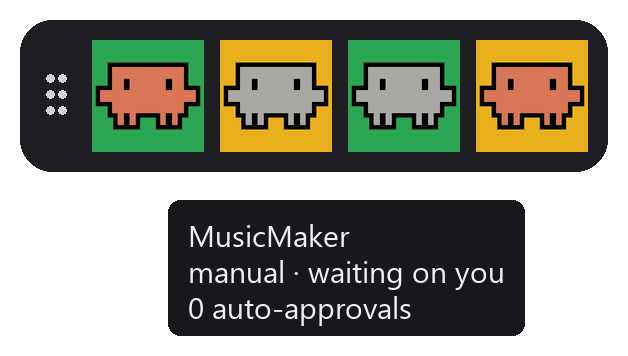
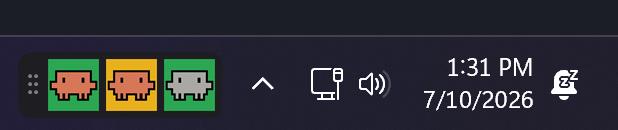

# Hooker 🪝

A little pixel mascot that auto-approves Claude Code prompts and shows, at a
glance, which of your Claude sessions needs you — an always-on-top **widget**
with one mascot tile **per session**.



## Reading a tile (two independent axes)

**Background = does it need you** · **Mascot = is it on autopilot**

|                        | 🟢 green (your turn)            | 🟡 yellow (working)   |
| ---------------------- | ------------------------------- | --------------------- |
| **salmon** (hooking)   | auto — but waiting on you        | auto-responding       |
| **grey** (manual)      | your turn                        | working, prompts normally |

- **Green** = that session is **waiting on you** (a prompt, a question, or it finished and wants the next task).
- **Yellow** = that session is **working** (busy — sit tight).
- **Salmon** mascot = **hooking** (its prompts auto-approve). **Grey** = **manual** (normal prompting).

Each tile is labeled with the session's **`/name`** (falling back to its folder; two unnamed sessions in the same folder are numbered `(1)`, `(2)` by launch order), and it goes yellow the instant Claude starts *thinking* — both read live from Claude's own session registry. Each session is independent: one can be on autopilot while another is hand-driven and a third sits waiting.

## The widget

A borderless, always-on-top strip. One tile per live session — here it is docked next to the system tray:



- **Left-click a tile** — toggle that session's hooking (salmon ⇄ grey).
- **Drag a tile** — reorder it (works locked or not), to match your terminal layout.
- **Drag the grip** (dots on the left) — move the whole widget (only when **unlocked**).
- **Hover a tile** — a tip (placed above/below, never over the tiles) shows `name · hooking/manual · working/waiting · N auto-approvals`.
- **Right-click** — menu: version, **Dismiss** (per tile), **Lock/Unlock position**, **System meter** (on/off), **New sessions appear** (right/left), **Grow direction** (auto / anchor-right / anchor-left), **Reset position**, **Save debug log**, **Exit**.

### System meter

The left-most "two tiles" (exactly two tiles + the gap wide) are a live meter: four vertical bars — **CPU, Memory, Network, GPU**, left to right — colored by load: **green** under 25%, **yellow** 25–50%, **red** over 50% (the same green/yellow as the session tiles). It's fixed in place (always first, never draggable), samples once a second off the UI thread, and pauses while the widget is hidden for a fullscreen app. Toggle it from the right-click menu.

- **CPU** is *real work* — the inverse of System Idle — not Task Manager's "% Processor Utility", which counts time the cores are merely awake and can read 70–90% on an idle machine (High-performance power plan, hypervisor present).
- **Network** is link utilization of the busiest adapter (throughput ÷ link speed), so everyday traffic on gigabit stays a sliver.
- **GPU** is the busiest engine of the busiest GPU, as Task Manager computes it.

**Hover** it for detail: CPU model, current/base speed, cores/logical processors, processes/threads/handles, uptime; memory in use/available/cached/committed; adapter name, send/receive, link speed; per-GPU name, dedicated memory, temperature and fan speed (where the driver reports them).

It stays **in front of the taskbar**, **hides** while a fullscreen app owns the same monitor (games safe), and defaults to **centered just above the taskbar**. Position, lock, order, anchor, new-session side, and the meter toggle persist to `widget.json`.

> **Start menu:** while the Windows 11 Start menu is *open*, it renders above all normal windows, so a widget sitting on/under it is hidden until Start closes — an OS limitation. Park it above the taskbar and off-center to always keep it visible.

### Stale tiles

A session that ends cleanly (`/exit`) removes its tile via `SessionEnd`. An abrupt close (killed terminal, crash) can't fire that hook — so the widget instead watches **Claude's own session registry** (files named by PID): the instant a session drops out of it (which Claude does even on an abrupt close), its tile is **evicted within ~1.5s**. Liveness is driven purely by that registry — a session that's *there* keeps its tile (even if it sits idle for days), and one that's *gone* loses it; there is no age-based timeout. If the registry is ever unavailable, tiles are left in place until it returns (self-healing: a live session's next hook event refreshes its tile) — and right-click → **Dismiss** clears one instantly.

Tiles come from the registry too: every live session gets a tile even if its hook hasn't fired yet (e.g. it was started before Hooker was installed), and a **Dismiss**ed tile stays dismissed until that session does something again or ends.

### Multi-monitor & display changes

**Wherever you park it, it stays there** — on any monitor. The widget remembers your chosen spot ("home") and returns to exactly it across display-configuration changes: a monitor added or removed, a **duplicate** toggled on/off, a resolution or DPI change. It's per-monitor DPI-aware and never lets Windows auto-resize it. The *only* time it touches its own position is when home momentarily doesn't fit any connected monitor (e.g. a duplicate dropped your resolution) — then it clamps just enough to stay visible, **without** overwriting home, so the instant your normal layout is back it snaps precisely home. Your spot only ever changes when *you* change it (drag the grip, or right-click → **Reset position**). It's anchored by the edge it grows from: a right-anchored strip keeps its **right** edge put even when it comes back a different width (sessions came or went while it was closed, or the meter was toggled).

## ⚠️ Security — read this

**Hooking is a permission bypass.** When a session's tile is salmon (hooking), Hooker **auto-approves every `PreToolUse` prompt** for that session — Bash commands, file writes/edits, network, memory writes, MCP tools, everything — with no confirmation. A session on autopilot has Claude's approval gate **turned off**, so a bad or prompt-injected instruction could run destructive or exfiltrating commands unattended.

Mitigations baked in:
- Hooking is **off by default**, per session.
- **Autopilot only exists while the widget is running.** `hook.exe` auto-approves only if the session is switched on *and* the widget is alive, so a crashed or killed widget grants nothing, whatever is left on disk. A clean exit also switches every session off.
- **Every widget start begins with all sessions manual.** That includes a restart after a crash or an update, so autopilot never outlives the widget run that granted it; turn tiles back on deliberately.
- **A resumed session starts manual.** `claude --resume` keeps the old session id, so its previous run's switch is cleared at startup. `/clear` and auto-compact keep the session's setting.
- Switches belonging to sessions that have ended are deleted, and **uninstall** clears them all.

Only turn a tile salmon when you trust what that session is doing. If in doubt, leave it grey and approve normally.

## How it works

```
widget (HookerWidget.exe) --writes--> ...\.claude\hooker\sessions\<sid>.state   ("on"/"off")
hooks  (hook.exe)         --writes--> ...\.claude\hooker\sessions\<sid>.meta    ({status,cwd,count})
                          <--read---  widget polls the .meta + Claude's session registry each 100ms
```

`hook.exe` is registered on six Claude events, all per session:
- `SessionStart` → new tile (waiting); on a new or resumed session also count reset + hooking off (`/clear` and compact keep both)
- `UserPromptSubmit` / `PreToolUse` → working (`PreToolUse` auto-approves + bumps the count when that session is hooking)
- `AskUserQuestion` (a `PreToolUse`) → waiting (Claude needs you to pick)
- `Stop`, `Notification` → waiting
- `SessionEnd` → removes the session's files

The widget also reads Claude's internal per-session registry (`~/.claude/sessions/*.json`) for which sessions are live, their `/name` title and live busy status — **best-effort**: it's undocumented and may change between Claude versions, in which case tiles fall back to folder names + hook-based status (nothing breaks).

The shim **fails open**: any error → prints nothing, exits 0 → Claude behaves normally. It never blocks Claude.

## Install (just want to use it)

No building — five steps, all double-clicks:

1. **Install the runtime** (one time). Download the free **[.NET Desktop Runtime 8](https://dotnet.microsoft.com/download/dotnet/8.0)** — under **"Run desktop apps"**, grab the **Windows x64** installer — and run it.
2. **Download Hooker.** Get the latest [**release**](../../releases) `.zip`, then right-click it → **Extract All**.
3. **Turn on the hooks.** Double-click **`Install Hooker.cmd`**. A window opens, prints *"Installed…"*, and waits for a keypress. *(It registers Hooker with Claude Code and backs up your existing settings first.)*
4. **Restart Claude Code.** Close and reopen any `claude` terminals so they load the hooks.
5. **Run the widget.** Double-click **`HookerWidget.exe`**. The mascot strip appears near your clock. **Click a tile** to put that session on autopilot (salmon = auto-approving); click again for manual (grey).

> ⚠️ Autopilot auto-approves **everything** for that session — read [Security](#️-security--read-this) first.

**Auto-start at login:** drop a shortcut to `HookerWidget.exe` into `shell:startup` (Win+R → `shell:startup`).

### Build from source instead

Needs the **.NET 8 SDK**. Then:
```powershell
powershell -ExecutionPolicy Bypass -File .\build.ps1          # -> dist\hook.exe, dist\HookerWidget.exe
powershell -ExecutionPolicy Bypass -File .\install-hook.ps1   # register hooks (or double-click "Install Hooker.cmd")
```
Restart Claude and run `dist\HookerWidget.exe`.

> **Moved or re-cloned the folder?** The hook command is an absolute path in `settings.json`, so re-run the installer after moving `hook.exe` (it replaces the old entry rather than adding a second one).

## Contributing

This is a personal tool, published as-is — **issues and pull requests aren't accepted** (PRs auto-close). Fork it and make it your own. 🪝

## Uninstall

```powershell
powershell -ExecutionPolicy Bypass -File .\uninstall-hook.ps1
```
Removes only Hooker's hooks (yours are preserved) and turns autopilot off for every session. Without them, Claude behaves exactly as stock.

## Troubleshooting

- **Nothing auto-approves / hook logs `command not found`.** Claude runs hooks through **bash**, which eats backslashes in a Windows path. The command must use **forward slashes** and be **quoted** (`"C:/…/hook.exe"`, so a space or parentheses in the path don't split it); the installer does both — if you hand-edited `settings.json`, fix it and restart Claude. Installs from v1.0.24 or earlier wrote the path unquoted: re-run the installer if Hooker's folder path has a space or parentheses.
- **Lost the widget?** Right-click any tile → **Reset position** (or it re-docks above the taskbar next launch).

## Caveat

Auto-approve covers every in-session tool/permission/memory prompt, but it can't bypass the initial folder **trust dialog** or other non-tool flows — by design.

## Layout

```
Hooker/
  Mascot.png              source art
  assets/make_icons.py    -> tile-<work|wait>_<on|off>.png  (bg=status, body=hooking)
  docs/mockup.py          -> promo images
  shim/                   hook.exe         (.NET console, per-session state)
  tray/                   HookerWidget.exe (.NET WinForms floating widget; SystemMeter.cs = the meter)
  dist/                   built exes
  build.ps1  install-hook.ps1  uninstall-hook.ps1  "Install Hooker.cmd"
  release.ps1             bump VERSION, build, tag and publish a GitHub release
```

## License

MIT — see [LICENSE](LICENSE). © 2026 RelentlessOldMan.
